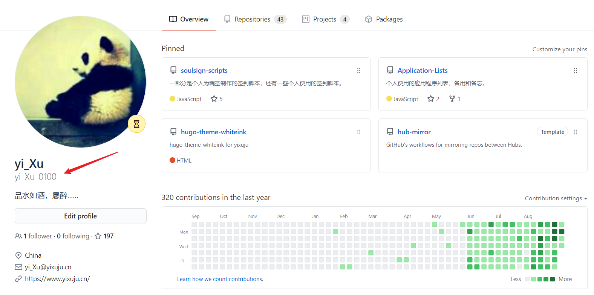
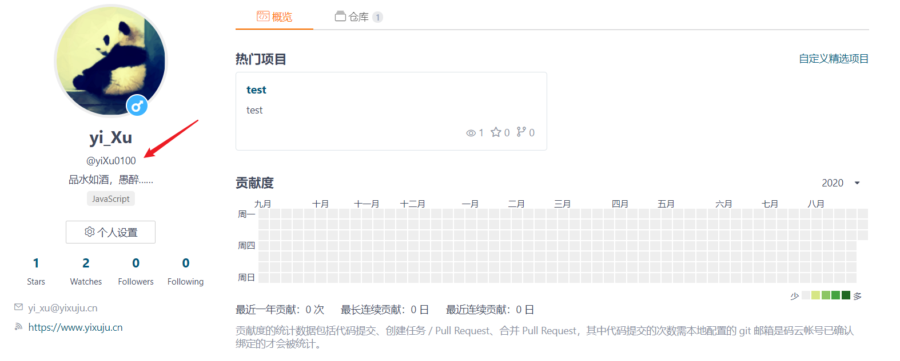
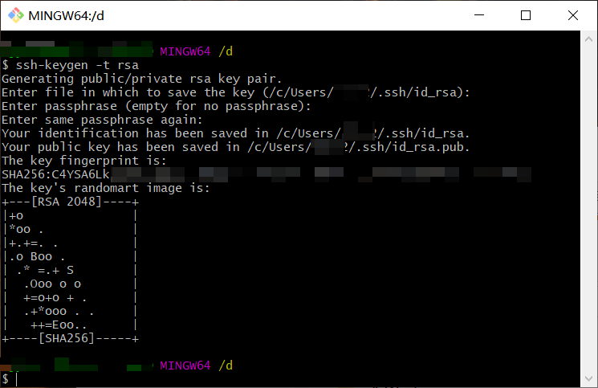
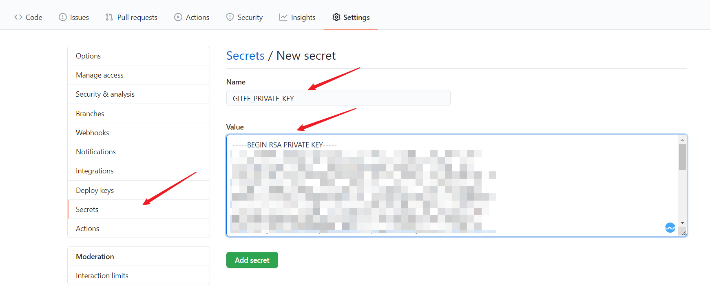
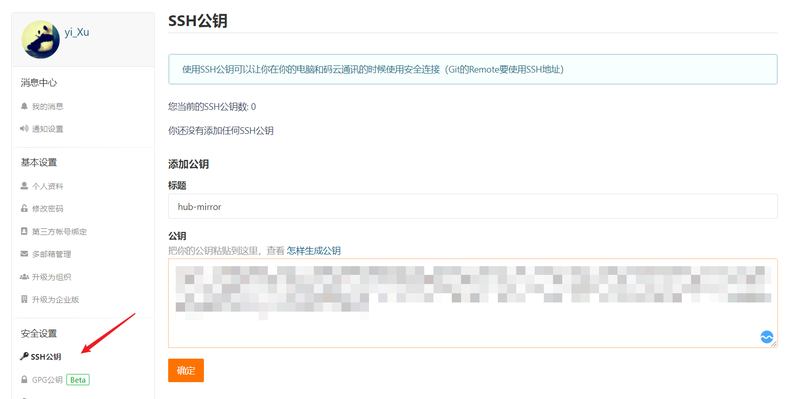
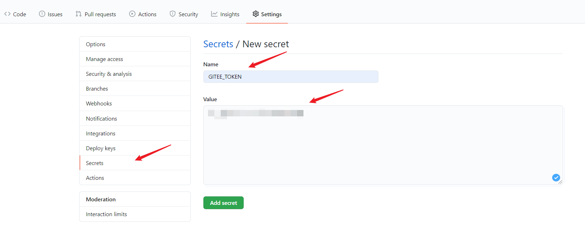

## Sync GitHub to other hub

[](./template/sync2gitee.yml)
[/badge.svg>)](./template/sync2gitee.cached.yml)
[/badge.svg>)](./template/sync2gitee.list.yml)
[](./)
[](https://github.com/yi-Xu-0100/hub-mirror/releases)
[](./LICENSE)

[简体中文](./README.md) | [English](./README_EN.md)

使用 [GitHub action - hub-mirror-action](https://github.com/Yikun/hub-mirror-action) 的模板仓库，可以管理当前 `GitHub` 与其他的 `hub` 的存储库 (当前仅包含 `Gitee` ) 的镜像同步。

**PS：当前的模板仓库仅使用了部分参数配置同步指令，[`template`](./template) 中的示例的参数仍然需要自行修改和配置以适配个人的流程使用。**

## 目录

- [Sync GitHub to other hub](#sync-github-to-other-hub)
- [目录](#目录)
- [配置参数](#配置参数)
  - [`src`(需要)](#src需要)
  - [`dst`(需要)](#dst需要)
  - [`dst_key`(需要)](#dst_key需要)
  - [`dst_token`(需要)](#dst_token需要)
  - [`static_list`(建议)](#static_list建议)
  - [`account_type`(建议)](#account_type建议)
  - [`force_update`(建议)](#force_update建议)
  - [`cache_path`(可选)](#cache_path可选)
- [FAQ](#faq)
  - [如何挑选模板](#如何挑选模板)
  - [`Gitee` 无法创建 `XXX` 仓库如何解决](#gitee-无法创建-xxx-仓库如何解决)
  - [`actions/cache` 的使用方法](#actionscache-的使用方法)
- [鸣谢](#鸣谢)
- [许可证](#许可证)

## 配置参数

### `src`(需要)

需要被同步的源端账户名，例如 `github/yi-Xu-0100` ，是 `GitHub` 中 `yi-Xu-0100` 账户。



### `dst`(需要)

需要同步到的目的端账户名，例如 `gitee/yiXu0100` ，是 `Gitee` 中 `yiXu0100` 账户。



### `dst_key`(需要)

`dst_key` 是用于目的端上传代码的 `SSH key` ，用于上传代码，你可以在 [这里](https://github.com/settings/keys) 中获得 `GitHub` 的 `SSH` 密钥配置，在 [这里](https://gitee.com/profile/sshkeys) 中获得 `Gitee` 的 `SSH` 密钥配置。

#### 设置 `dst_key`

1. 安装 `Git` 并启动 `GitBash`
2. 运行以下命令以生成 `SSH` 密钥对（图片中使用的默认配置，即跳过所有设置）

   ```sh
   ssh-keygen -t rsa
   ```

   

3. 根据第二步获得的路径，将密钥对分别添加到两个库中（以 `GitHub` 和 `Gitee` 为例）

   1. 将私钥（ `id_rsa` ）添加到 `GitHub` 存储库。通过 `GitHub` **仓库设置** 中的 `Secrets` 创建一个 `GITEE_PRIVATE_KEY` 变量，然后将私钥内容复制到值区域。

      

   2. 将公钥（ `id_rsa.pub` ）添加到 `Gitee` 存储库。通过 `Gitee` **个人设置** 中的 `SSH公钥` 创建一个 `hub-mirror` 变量，然后将公钥内容复制到值区域。

      

### `dst_token`(需要)

`dst_token` 是 创建仓库的 `API tokens`， 用于自动创建不存在的仓库。你可以在 [这里](https://github.com/settings/tokens) 中获得 `GitHub` 令牌，并在 [这里](https://gitee.com/profile/personal_access_tokens) 中获得 `Gitee` 令牌。

#### 设置 `dst_token`

以 `Gitee` 为例，获取令牌后添加到 `GitHub` 中。

1. 通过 `Gitee` **个人设置** 中的 `私人令牌` 生成 `GITEE_TOKEN`，并将令牌内容复制到值区域。

   PS：令牌仅出现一次，请保存它（它可以生成多次）。

   

2. 将令牌添加到 `GitHub` 存储库，通过 `GitHub` **仓库设置** 中的 `Secrets` 创建一个 `GITEE_TOKEN` 变量，并将私钥内容复制到值区域。

   

### `static_list`(建议)

`static_list` 配置后，仅同步静态列表，不会再动态获取需同步列表（黑白名单机制依旧生效），如: `'repo1,repo2,repo3'` 。同时，设置仓库名称时需要注意以下问题：

- 仓库名称注意大小写和符号。
- [`hub-mirror-action@v0.10`](https://github.com/marketplace/actions/hub-mirror-action) 会对克隆仓库进行镜像同步，会在另一个 `hub` 中创建 `GitHub` 下克隆的仓库（`Gitee` 中无法显示克隆关系）。
- **[`hub-mirror-action@v0.10`](https://github.com/marketplace/actions/hub-mirror-action) 对私有仓库和空仓库无法完成镜像同步**，会设置错误，但不会打断同步过程，对其他的仓库仍然能够完成同步并在最后给出统计信息。

**[`Template`](./template) 中的配置:**

1. [`sync2gitee.yml`](./template/sync2gitee.yml) 和 [`sync2gitee.cached.yml`](./template/sync2gitee.cached.yml) 中的 `static_list` 使用的变量由 [`actions/github-script`](https://github.com/actions/github-script) 输出结果设置，即当前仓库（即模板仓库），如需增加或修改，使用逗号隔开，如: `'${{ steps.info.outputs.result }},MY_REPO'` 。这两个示例一般用于[单仓库使用](#单仓库使用)。
2. [`sync2gitee.list.yml`](./template/sync2gitee.list.yml) 中的 `static_list` 使用的变量设置为 [`yi-Xu-0100/repo-list-generator`](https://github.com/marketplace/actions/repo-list-generator) 生成的 `repoList` 。`repoList` 默认会把私有仓库和克隆仓库去除，但**仍然会包含空仓库**，可能触发错误，一般用于[多仓库使用](#多仓库使用)。

### `account_type`(建议)

`account_type` 配置使用需要同步仓库的用户属性，请确保类型相同，无法指定两个。

- 如果是个人，则需要设置为 `user` 。
- 如果是组织，则需要设置为 `org` 。

### `force_update`(建议)

`force_update` 配置是否强制同步，此选项用于 `GitHub` 与 `Gitee` 仓库内容冲突时。

- 如果配置为 `true` ，会将 `GitHub` 仓库的内容强制推送到 `Gitee` 中。
- 如果配置为 `false` ，不会将 `GitHub` 仓库的内容强制推送到 `Gitee` 中。

### `cache_path`(可选)

**注意：如果 `cache` 配置不当，依然会造成整个仓库的同步时间过长。详细配置见 [`actions/cache` 的使用方法](#actionscache-的使用方法)** 。

`cache_path` 选项需要搭配 [`actions/cache`](https://github.com/actions/cache) 使用，配置后会对同步的仓库内容进行缓存，缩短仓库同步时间。

- [`sync2gitee.yml`](./template/sync2gitee.yml) 是未配置 `cache_path` 的使用示例。
- [`sync2gitee.cached.yml`](./template/sync2gitee.cached.yml) 和 [`sync2gitee.list.yml`](./template/sync2gitee.list.yml) 是配置了 `cache_path` 的使用示例。

## FAQ

### 如何挑选模板

#### 单仓库使用

单仓库一般仓库体积不大，由于 [`sync2gitee.yml`](./template/sync2gitee.yml) 和 [`sync2gitee.cached.yml`](./template/sync2gitee.cached.yml) 中的 `static_list` 仅设置了当前仓库（自动获取的仓库名），可以不增加参数，而选择将 [`template`](./template) 文件夹下的对应示例文件放置在任意仓库的 `.github/workflows` 下，以实现仅同步*含有该文件的仓库*的配置（选其中之一即可）。

**[`sync2gitee.cached.yml`](./template/sync2gitee.cached.yml) 的使用说明在 [单仓库使用配置](#单仓库使用配置) 中给出。二者的 `hub-mirror-action` 部分参数同样需要 [配置](#配置参数) 。**

#### 多仓库使用

由于 `hub-mirror-action` 的自动获取仓库名称会包含克隆的仓库，所以少量同步可以在 [单仓库使用](#单仓库使用) 的情况下 [配置 `static_list` 参数](#static_list建议)，完成对指定仓库的同步配置。

如果希望完成用户名下所有仓库同步的同步配置，可以使用 [`sync2gitee.list.yml`](./template/sync2gitee.list.yml) ，该示例使用 [`yi-Xu-0100/repo-list-generator`](https://github.com/marketplace/actions/repo-list-generator) 获取用户的所有的仓库名称，而**其产生的 `repoList` 参数会剔除克隆仓库和私有仓库名称**。

**详细的配置说明见 [多仓库使用配置](#多仓库使用配置) ，`hub-mirror-action` 部分参数同样需要 [配置](#配置参数) 。**

### `Gitee` 无法创建 `XXX` 仓库如何解决

`Gitee` 创建仓库名称要求：只允许包含字母、数字或者下划线( `_` )、中划线( `-` )、英文句号( `.` )，**必须以字母开头**，且长度为 2~191 个字符。如果你的仓库开头是特殊符号和数字，则会中断创建过程，造成同步失效。

解决方案：

1. ~~可以使用 `Gitee` 提供的服务直接从 `GitHub` 导入仓库，参考 [Gitee 帮助手册](https://gitee.com/help/articles/4261) ，此服务同样要求：只允许字母、数字或者下划线( `_` )、中划线( `-` )、英文句号( `.` )，**必须以字母或数字开头**。~~
2. 方案 1 由于官方更改规则，现已失效，导入的规则和创建规则一致，官方文档应该会稍后完成更新【2020-10-14】。
3. 如果仓库名称以**字母或特殊符号**开头，可以使用 [重命名仓库](https://docs.github.com/cn/free-pro-team@latest/github/administering-a-repository/renaming-a-repository) 或者 [删除仓库](https://docs.github.com/cn/free-pro-team@latest/github/administering-a-repository/deleting-a-repository) 并[创建仓库](https://docs.github.com/cn/free-pro-team@latest/github/creating-cloning-and-archiving-repositories/creating-a-repository-on-github) 的方式完成仓库改名。

### [`actions/cache`](https://github.com/actions/cache) 的使用方法

#### 单仓库使用配置

仓库中的同步流程使用了 [`actions/cache`](https://github.com/actions/cache) 这一个动作完成仓库的缓存。[`template/sync2gitee.cache.yaml`](./template/sync2gitee.cached.yml) 中对于缓存仓库的设置已经完成，**不需要修改**。为了完成 `cache` 的参数配置，同时需要构建 `key` 所需要的参数，所以使用了**三个步骤**去完成 `cache` 的配置。

```yaml
- name: Get repo and time
  id: info
  uses: actions/github-script@v3.0.0
  with:
    result-encoding: string
    script: |
      core.setOutput('time', new Date(Date.now()).toISOString().replace(/[^0-9]/g, ""));
      core.setOutput('key', `${context.repo.owner}-${context.repo.repo}`);
      return context.repo.repo;

- name: Cache src repos
  uses: actions/cache@v2.1.2
  id: cache
  with:
    path: ${{ github.workspace }}/hub-mirror-cache
    key: ${{ runner.os }}-${{ steps.info.outputs.key }}-cache-${{ steps.info.outputs.time }}
    restore-keys: ${{ runner.os }}-${{ steps.info.outputs.key }}-cache-

- name: Mirror the GitHub repos to Gitee with cache
  uses: Yikun/hub-mirror-action@v0.10
  with:
    src: github/yi-Xu-0100
    dst: gitee/yiXu0100
    dst_key: ${{ secrets.GITEE_PRIVATE_KEY }}
    dst_token: ${{ secrets.GITEE_TOKEN }}
    static_list: '${{ steps.info.outputs.result }}'
    cache_path: /github/workspace/hub-mirror-cache
    account_type: user
    force_update: true
```

**说明：**

- `id` 为 `info` 的步骤使用了 [`actions/github-script`](https://github.com/actions/github-script) 获取仓库名称用于 [`static_list` 参数配置](#static_list建议)，触发时间戳（`ISO` 格式并仅保留数字）和 `cache` 使用的关键词 `{owner}-{repo}` 。
- `path` 变量设置的路径的设置与 `hub-mirror-action` 中的参数 `cache_path` 设置的路径（`/github/workspace/hub-mirror-cache`）相对应（建议不修改，当前配置的路径为参数配置的默认值）。
- `key` 变量的设置与运行环境（由 `runner.os` 获取）、仓库拥有者和仓库名称的键值对（由 `steps.info.outputs.key` 获取），最后以触发时间戳（由 `steps.info.outputs.time` 获取）确定特异性（相关信息已通过流程步骤获取，建议不修改），保证每次会对内容重新缓存。
- `restore-keys` 仅匹配前置关键词，这样保证每次获取最近一次的缓存结果。
- `key` 在 `7` 天未触发或者缓存结果存储大小大于 `5G` 的情况下，会删除旧的缓存文件。
- 详细 `cache` 的配置说明见 [`cache` 仓库文档](https://github.com/actions/cache#readme) 。
- `hub-mirror-action` 部分参数仍然需要 [配置](#配置参数) 。

#### 多仓库使用配置

仓库中的同步流程使用了 [`actions/cache`](https://github.com/actions/cache) 这一个动作完成仓库的缓存。[`template/sync2gitee.list.yaml`](./template/sync2gitee.list.yml) 中对于缓存仓库的设置已经完成，具体配置和 [单仓库使用配置](#单仓库使用配置) 一致。下面主要介绍 `static_list` 的配置。

```yaml
- name: Generate repo list
  id: repo
  uses: yi-Xu-0100/repo-list-generator@v0.2.0
  with:
    user: yi-Xu-0100
    my_token: ${{ secrets.REPO_TOKEN }}

- name: Mirror hub with cache and list
  uses: Yikun/hub-mirror-action@v0.10
  with:
    src: github/yi-Xu-0100
    dst: gitee/yiXu0100
    dst_key: ${{ secrets.GITEE_PRIVATE_KEY }}
    dst_token: ${{ secrets.GITEE_TOKEN }}
    static_list: '${{ steps.repo.outputs.repoList }}'
    cache_path: /github/workspace/hub-mirror-cache
    account_type: user
    force_update: true
```

**说明：**

- `id` 为 `repo` 的步骤使用了 [`yi-Xu-0100/repo-list-generator`](https://github.com/marketplace/actions/repo-list-generator) 获取用户的所有的仓库名称。
- `${{ secrets.REPO_TOKEN }}` 的配置参考 [Generate `my_token`](https://github.com/marketplace/actions/repo-list-generator#-generate-my_token) 。
- `static_list` 使用 `${{ steps.repo.outputs.repoList }}` 指定同步列表，`repoList` 参数会剔除克隆仓库和私有仓库名称。
- 如果需要剔除部分仓库，可以使用 [black_list](https://github.com/marketplace/actions/hub-mirror-action#可选参数) 。
- 如果需要添加未包含的仓库，可以使用 [white_list](https://github.com/marketplace/actions/hub-mirror-action#可选参数) 。
- `hub-mirror-action` 部分参数仍然需要 [配置](#配置参数) 。

## 鸣谢

- [ShixiangWang/sync2gitee](https://github.com/ShixiangWang/sync2gitee)
- [Yikun/hub-mirror-action](https://github.com/Yikun/hub-mirror-action)
- [actions/checkout](https://github.com/actions/checkout)
- [actions/cache](https://github.com/actions/cache)
- [actions/github-script](https://github.com/actions/github-script)
- [yi-Xu-0100/repo-list-generator](https://github.com/marketplace/actions/repo-list-generator)

## 许可证

[MIT](./LICENSE)
